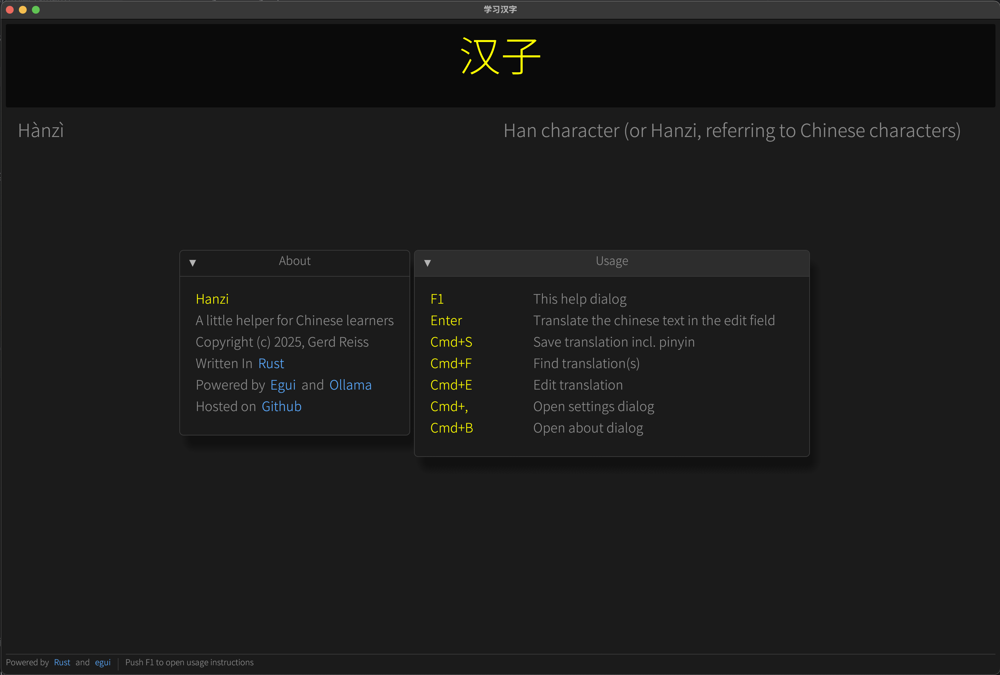

# 汉字

Note: this project is a work in progress!

The goal of this project is to create a simple desktop app that queries a LLM model for translation and save it to a database, to be used later for learning.

## Usage

Before using
1. Install [Ollama](https://ollama.com/)
2. `ollama run <model>` - take the model from the [model library](https://ollama.com/library)

How-to
1. Enter any chinese phrase into the text field, push enter
2. Pinyin and translation appear below
3. <Ctrl+S> on Linux or <Cmd+S> to save the phrase into the database
4. <Ctrl+F> on Linux or <Cmd+F> to search for saved phrases
5. <Ctrl+,> on Linux or <Cmd+,> to open settings

